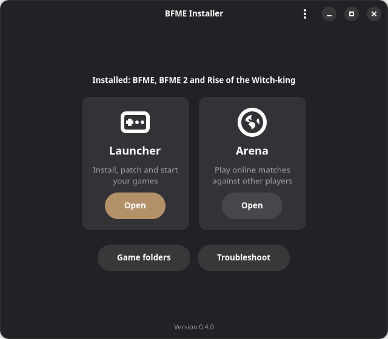
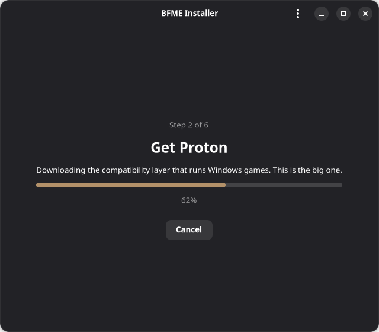
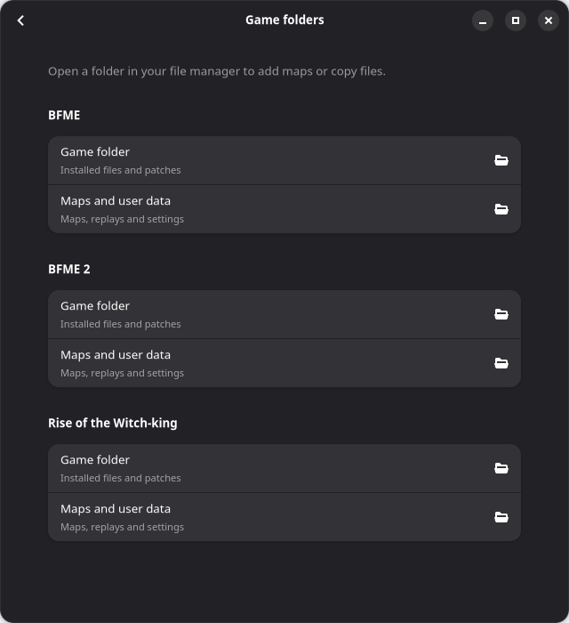
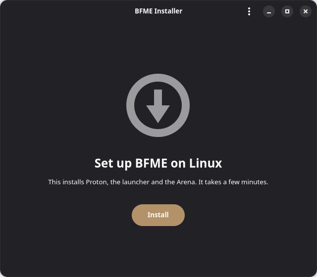
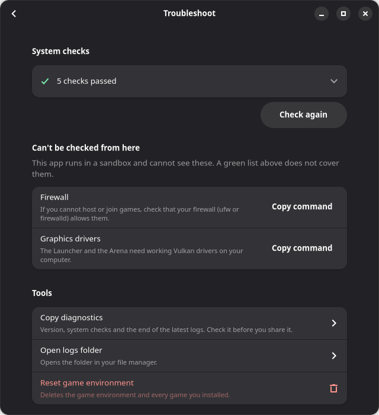

<div align="center">

# BFME Installer

**Play Battle for the Middle-earth on Linux, from one guided setup.**

Installs and runs the community All-in-One Launcher and Online Arena from [bfmeladder.com](https://bfmeladder.com) for
*The Battle for Middle-earth*, *The Battle for Middle-earth II* and *The Rise of the Witch-king*, under Proton.

[](https://github.com/JGBMichalski/bfme-installer/releases/latest)
[](https://github.com/JGBMichalski/bfme-installer/actions/workflows/build-linux.yml)
[](LICENSE)



</div>

## Why

Running these games on Linux used to mean hand-building a Wine prefix, picking the right DLL overrides, and fixing the
multiplayer "Out of Sync" error by trial and error. BFME Installer does that once, the same way every time, and then
gets out of your way.

- **One command to install.** Paste one line into a terminal and the wizard opens, ready to set up the Launcher, Arena and Workshop Studio.
- **A guided window.** Checks your system, downloads Proton, builds the game environment and tells you in plain words
  when something needs your attention.
- **Launcher, Arena and Workshop Studio side by side.** All three share one game environment, so maps and games installed
  in one are there in the others.
- **Online play with Windows players.** The prefix settings that stop "Out of Sync" errors are applied for you.
- **Updates itself.** The app tells you when a new release exists and installs it through Flatpak.
- **Easy to fix.** A Troubleshoot page re-runs the system checks, copies a report for bug reports, opens the logs, and
  can reset the game environment.

## Screenshots

| Set up | Home | Game folders |
| :---: | :---: | :---: |
|  |  |  |
| Step-by-step progress, with Cancel and Resume. | Open the Launcher or the Arena. | Jump to a game's folder or its maps. |

<details>
<summary>More screenshots</summary>

<br>

| Welcome | Troubleshoot |
| :---: | :---: |
|  |  |

</details>

## Install

Copy this into a terminal:

```sh
curl -fsSL https://github.com/JGBMichalski/bfme-installer/releases/latest/download/install-flatpak.sh | bash
```

It installs the app as a Flatpak, adds the 32-bit parts Flatpak needs, and opens the setup wizard, which walks you through the rest.

The same commands are also available on the [install page](https://jgbmichalski.github.io/bfme-installer/).

To update, press **Update** in the app when it offers one, or run the same command again.

### Requirements

- A 64-bit (x86_64) Linux distribution with [Flatpak](https://flatpak.org/setup/). The installer prints the command for
  your distribution if Flatpak is missing.
- Working Vulkan drivers, 64-bit and 32-bit. The wizard checks this and shows the fix when something is missing.
- Enough free disk space for Proton and the games. The wizard checks this too.
- A copy of the games. The Launcher installs and patches them.

## Using it

1. Open **BFME Installer** from your menu and press **Install**. The first run downloads Proton, so it takes a few
   minutes. You can cancel and resume.
2. On the home screen, open the **Launcher** and install your games.
3. Start online matches from the **Arena**. Always start it on its own, never from the Launcher's Multiplayer tab, where
   it draws outside the Launcher's window.

The home screen and application menu also include **Workshop Studio**. It is downloaded the first time you open it and runs in the same Proton environment as the Launcher and Arena.

See [Workshop Studio documentation](docs/workshop-studio.md) for its download location, shared prefix and command-line entry point.

The menu also gets **BFME All-in-One Launcher**, **BFME Online Arena** and **BFME Workshop Studio** entries that start the
program directly, with no window.

### Add maps and copy files

Press **Game folders** on the home screen. Each installed game has two buttons:

- **Game folder**: the installed files and patches.
- **Maps and user data**: where the game keeps its maps, replays and settings. The game creates this folder the first
  time it runs, so for a game you have not started yet the button opens the game folder instead.

The folders open in your file manager, so you can drop in maps or copy over existing files. A game that is not installed
shows "Not installed".

### When something goes wrong

Open **Troubleshoot** (home screen or the menu at the top right). It can:

- re-run the system checks and show a fix command you can copy;
- copy a diagnostics report for a bug report (check it first, because it can contain your home folder name);
- open the logs folder;
- **reset** the game environment. This deletes the environment *and every installed game*, then starts the setup again.
  Downloads and Proton are kept.

## Without Flatpak

Run the setup script in a terminal. It does the same setup without the wizard.

```sh
./scripts/bfme-linux-setup.sh doctor     # check requirements
./scripts/bfme-linux-setup.sh install    # set up the runner, launcher, Arena and menu shortcuts
```

Then open **BFME All-in-One Launcher** from your menu and install the games. Start the Arena from its own
**BFME Online Arena** shortcut.

Other commands: `launcher`, `arena`, `workshop`, `game bfme1|bfme2|rotwk`, `shortcuts`, `status`, `reset-prefix --yes`, `help`.
Configuration variables (such as `BFME_HOME` and `BFME_RUNNER=wine`) are in [How it works](docs/how-it-works.md).

## Planned

This is a direction, not a promise, and it has no dates.

- [ ] **Repair.** Fix a damaged setup without deleting the game environment, so [Reset](#when-something-goes-wrong) is not the only way out.
- [ ] **Error details.** An expandable log on the "Something went wrong" screen, so you can see what failed without opening the logs folder.

## Contributing

Bug reports and pull requests are welcome. See [CONTRIBUTING.md](CONTRIBUTING.md) for more information. When you report a problem, press **Copy diagnostics** on the Troubleshoot page and paste the report into the issue.

## Acknowledgements

This project does not include or change the Launcher, the Arena or the games. They belong to their own authors and
publishers. Thanks to the community behind the Launcher and Arena at [bfmeladder.com](https://bfmeladder.com), and to the [umu-launcher](https://github.com/Open-Wine-Components/umu-launcher) and Proton
projects that run them.
